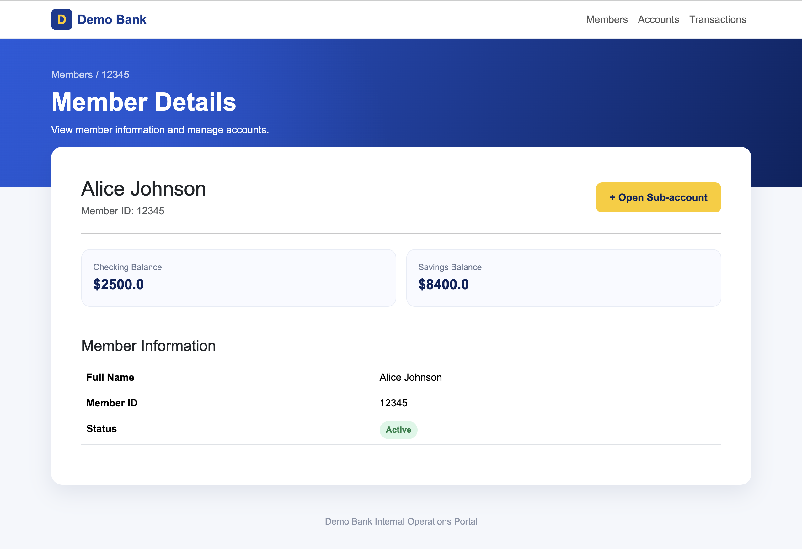
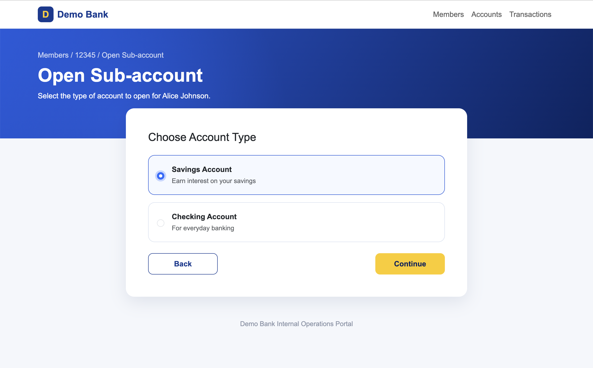

# Computer-Use Automation System

An LLM-driven computer-use agent that discovers browser workflows and converts them into typed artifacts for deterministic replay.

<p align="center">
  
  
</p>

<p align="center">
  <strong>LLM Discovery → Typed Artifact → Deterministic Replay → Human Handoff</strong>
</p>

## Overview

This project demonstrates a complete automation lifecycle:

- an LLM discovers a workflow against a live UI,
- the workflow is saved as a typed, versioned artifact,
- the artifact replays deterministically without LLM decisions,
- failures can escalate to a human while preserving the live browser session.

## Architecture

```text
Natural-Language Goal
        |
        v
+-----------------------+
| LLM Discovery Agent   |
| observe -> decide     |
| -> act                |
+-----------------------+
        |
        v
+-----------------------+
| Typed Pydantic        |
| Workflow Artifact     |
+-----------------------+
        |
        v
+-----------------------+
| Deterministic Replay  |
| No LLM decisions      |
+-----------------------+
        |
        +----> Structured Logs
        +----> Failure Evidence
        +----> Human Handoff
```

The demo workflow uses a local Django banking application:

```text
Search Member
    ↓
Open Sub-account
    ↓
Select Savings
    ↓
Continue
    ↓
Verify Confirmation
```

## Key Features

- LLM-driven observe → decide → act discovery loop
- Structured LLM actions
- Typed and versioned Pydantic workflow artifacts
- Runtime input parameterization
- Deterministic Selenium replay without LLM decisions
- Explicit success-condition verification
- Business outcome / recoverable error / hard failure distinction
- Bounded retries
- Domain and action allowlists
- Sensitive-data redaction in logs
- Structured JSONL execution logs
- Failure screenshots
- Human takeover of the same live Selenium session
- Minimal Django Operator Console

## Project Structure

```text
computer-use-automation/
├── manage.py
├── requirements.txt
├── README.md
├── REPORT.md
│
├── demo_bank/
│
├── bank/
│   └── templates/
│       └── bank/
│           ├── base.html
│           ├── search_member.html
│           ├── member_detail.html
│           ├── open_account.html
│           ├── confirmation.html
│           ├── member_not_found.html
│           └── operator_console.html
│
├── automation/
│   ├── artifact.py
│   ├── discovery.py
│   ├── replay.py
│   ├── handoff_state.py
│   └── selenium_demo.py
│
├── artifacts/
│   ├── open_savings_account.json
│   └── discovered_open_savings_account.json
│
└── evidence/
    ├── discovery_log.jsonl
    ├── replay_log.jsonl
    ├── discovered_open_savings_account.json
    ├── handoff_state.json
    └── failures/
```

## Setup

### 1. Clone the repository

```bash
git clone https://github.com/fiona-oc/computer-use-automation.git
cd computer-use-automation
```

### 2. Create a virtual environment

```bash
python3 -m venv venv
source venv/bin/activate
```

On Windows:

```bash
venv\Scripts\activate
```

### 3. Install dependencies

```bash
pip install -r requirements.txt
```

### 4. Configure the OpenAI API key

Create a `.env` file in the project root:

```text
OPENAI_API_KEY=your_api_key_here
```

The API key is required for discovery only. Deterministic replay does not call the LLM.

Do not commit `.env`.

## Run the Demo

Two terminal windows are useful for the demo.

### Terminal 1 — Start the Demo Bank

Activate the virtual environment and run:

```bash
python manage.py runserver
```

The application will be available at:

```text
http://127.0.0.1:8000/
```

The Operator Console is available at:

```text
http://127.0.0.1:8000/operator/
```

### Terminal 2 — Run LLM Discovery

With the Django server running:

```bash
python automation/discovery.py
```

The discovery agent is given the goal:

```text
Open a savings sub-account for member 12345.
```

It observes the live UI and chooses browser actions until the goal is complete.

A successful run produces a reusable artifact at:

```text
artifacts/discovered_open_savings_account.json
```

Discovery evidence is written to:

```text
evidence/discovery_log.jsonl
```

## Deterministic Replay

Replay the discovered artifact using a different member:

```bash
python automation/replay.py \
  --artifact artifacts/discovered_open_savings_account.json \
  --member-id 67890
```

Replay executes the saved artifact directly. It does **not** invoke the LLM.

A successful result should include:

```text
status: success
```

and the account-creation confirmation output.

Replay events are recorded in:

```text
evidence/replay_log.jsonl
```

## Artifact Example

A discovered step is represented as structured data:

```json
{
  "id": "step_1",
  "action": "fill",
  "locator": {
    "strategy": "id",
    "value": "member_id"
  },
  "value": "{{member_id}}"
}
```

The member used during discovery is converted into the runtime parameter:

```text
{{member_id}}
```

This allows one discovered workflow to be reused with different inputs.

## Error Handling

Replay distinguishes between four result categories:

```text
success
business_outcome
recoverable_error
hard_failure
```

For example, searching for a member that does not exist is an expected business outcome rather than an automation crash.

UI steps use explicit waits and bounded retries. Unexpected failures are logged with contextual information.

## Human-in-the-Loop Demo

Human handoff can be demonstrated by intentionally making one artifact locator invalid.

For example, temporarily change:

```json
"value": "open-account-button"
```

to:

```json
"value": "fake-button"
```

Then run replay.

The executor retries the failed step. After the retry limit is reached, automation pauses and records the handoff state.

Open:

```text
http://127.0.0.1:8000/operator/
```

The Operator Console displays the failed step and current browser state.

Complete the blocked action manually in the **same Selenium-controlled Chrome session**. Return to the replay process and confirm that the intervention succeeded.

Replay then continues from the next artifact step.

Restore the locator to `open-account-button` after the test.

## Safety

The prototype applies safety controls outside the LLM decision process.

Current controls include:

- navigation host allowlisting
- action allowlisting
- typed artifact validation
- bounded discovery steps
- bounded replay retries
- sensitive-value redaction
- failure evidence and structured audit logs

Sensitive runtime values are replaced with:

```text
[REDACTED]
```

before logs are persisted.

The prototype intentionally does not execute real financial or irreversible actions.

## Evidence

Example end-to-end evidence is stored under:

```text
/evidence/
```

It contains:

- a generated workflow artifact
- discovery logs
- deterministic replay logs
- human-handoff state
- representative failure evidence

These demonstrate the complete path from LLM-driven discovery to deterministic reuse.

## Design Decisions and Trade-offs

See [`REPORT.md`](REPORT.md) for the detailed discussion of:

- architecture
- artifact schema
- deterministic replay and error handling
- heterogeneous surfaces and multi-tenant reuse
- escalation and human handoff
- safety
- deliberate cuts and next steps